  

## 📌 About Me
- 💻 Building Full Stack Web Applications using MERN & PostgreSQL
- 🌱 Currently learning AI, Machine Learning & System Design
- 🏆 Hackathon Enthusiast and Open Source Learner
- 🚀 Passionate about UI/UX, Automation and Creative Development
- 🎯 Solved 300+ DSA problems on LeetCode
- 📚 Computer Engineering Student at IIIT Bhubaneswar
- ⚡ Fun fact: I love coding, photography and creating beautiful interfaces

## 🧠 My Focus Areas
- Full Stack Development
- UI/UX Design
- Web Performance
- Cloud Deployment

## 📊 GitHub Stats & Trophies

  
  

  

  

  

## 🛠️ Languages & Tools

<h3 align="center">Programming Languages</h3>

  
  
  
  

<h3 align="center">Frontend</h3>

  
  
  
  
  
  

<h3 align="center">Backend</h3>

  
  

<h3 align="center">Database</h3>

  
  
  

<h3 align="center">DevOps & Cloud</h3>

  
  

<h3 align="center">Tools</h3>

  
  
  
  
  

  

 

## 🔗 Connect with Me

  &nbsp;
  &nbsp;
  

<picture>
  <source media="(prefers-color-scheme: dark)" srcset="https://raw.githubusercontent.com/abozanona/abozanona/output/pacman-contribution-graph-dark.svg">
  <source media="(prefers-color-scheme: light)" srcset="https://raw.githubusercontent.com/abozanona/abozanona/output/pacman-contribution-graph.svg">
  
</picture>

  

